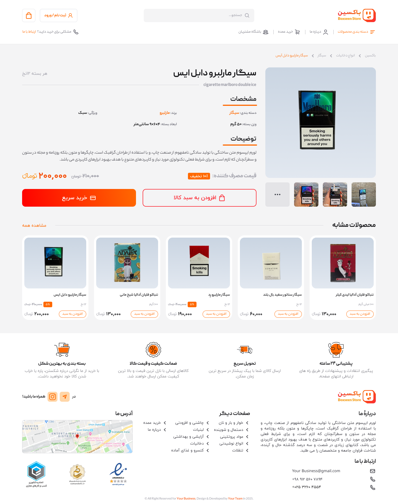
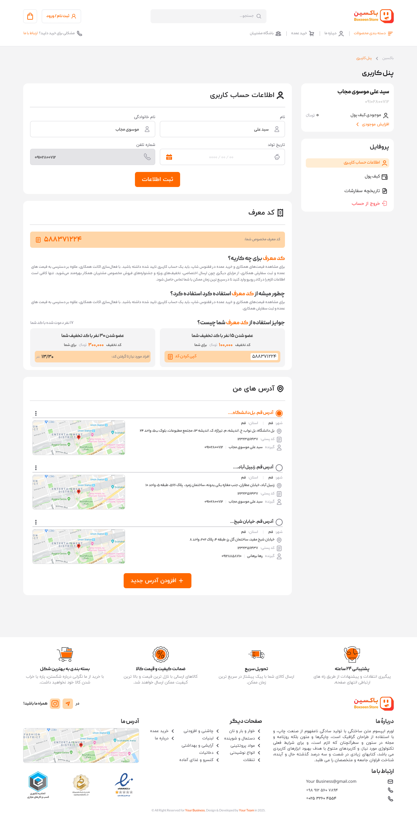

# 🛒 BoxSeen | فروشگاه آنلاین محصولات

<strong>BoxSeen</strong> یک وب‌اپلیکیشن فروشگاهی مدرن و مقیاس‌پذیر برای فروش آنلاین محصولات است. این پروژه با استفاده از فریم‌ورک قدرتمند <strong>Django</strong> و پایگاه داده <strong>PostgreSQL</strong> توسعه یافته و تجربه کاربری عالی برای خریداران و مدیران فروشگاه فراهم می‌کند.

> ⚠️ **توجه:** کدهای منبع به دلیل محرمانه بودن پروژه اصلی، در اینجا موجود نیستند. این مخزن شامل مستندات فنی، معماری و دموهای وب‌سایت است.

---

## ✨ ویژگی‌های کلیدی

### 🏠 برای کاربران
*   **کاتالوگ محصولات:** نمایش دسته‌بندی شده محصولات با تصاویر با کیفیت، قیمت و توضیحات کامل.
*   **سبد خرید پویا:** افزودن، ویرایش و حذف محصولات از سبد خرید به صورت آنی.
*   **فرآیند پرداخت امن:** اتصال به درگاه‌های پرداخت بانکی و مدیریت وضعیت سفارشات.
*   **پروفایل کاربری:** مشاهده تاریخچه سفارشات، مدیریت آدرس‌ها و تغییر اطلاعات شخصی.
*   **جستجوی پیشرفته:** جستجو در بین محصولات بر اساس نام، دسته‌بندی و قیمت.

### 👨‍💻 برای ادمین‌ها
*   **پنل مدیریت قدرتمند:** مدیریت کامل محصولات، دسته‌بندی‌ها، کاربران و سفارشات.
*   **مدیریت سفارشات:** مشاهده وضعیت سفارشات (در حال پردازش، ارسال شده، تحویل داده شده) و تغییر آن‌ها.
*   **گزارش‌گیری:** مشاهده آمار فروش، درآمد و محبوب‌ترین محصولات.
*   **مدیریت کاربران:** نظارت بر کاربران و مدیریت دسترسی‌ها.

---

## 🛠️ تکنولوژی‌ها و معماری

این پروژه با رعایت اصول **Clean Code** و **معماری MTV (Model-Template-View)** دجنو ساخته شده است:

| لایه | تکنولوژی‌ها | توضیحات |
| :--- | :--- | :--- |
| **Backend** | Python, Django, Django REST Framework (DRF) | پیاده‌سازی بک‌اند و APIها |
| **Database** | PostgreSQL, Django ORM | ذخیره‌سازی امن و مدیریت داده‌ها |
| **Frontend** | HTML5, CSS3, JavaScript, Bootstrap 5 | طراحی رابط کاربری واکنش‌گرا |
| **Image Processing** | Pillow | بهینه‌سازی و تغییر سایز تصاویر محصولات |
| **Deployment** | Nginx, Gunicorn | کانتینرایز کردن و استقرار در سرور |

---

## 📸 دمو و اسکرین‌شات‌ها

### 1. صفحه اصلی و کاتالوگ محصولات

### 2. صفحه جزئیات محصول

### 3. سبد خرید و پرداخت

### 4. پنل کاربری

---
